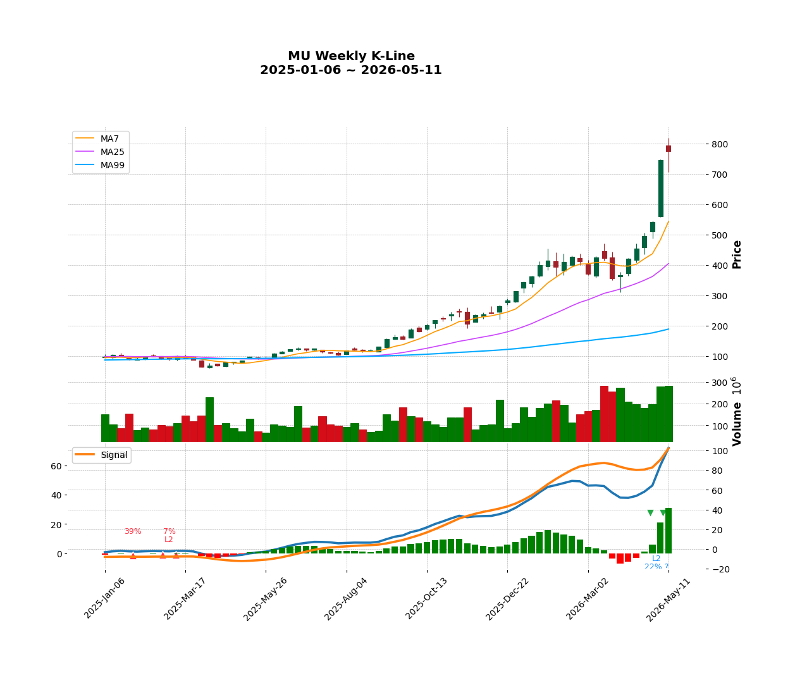
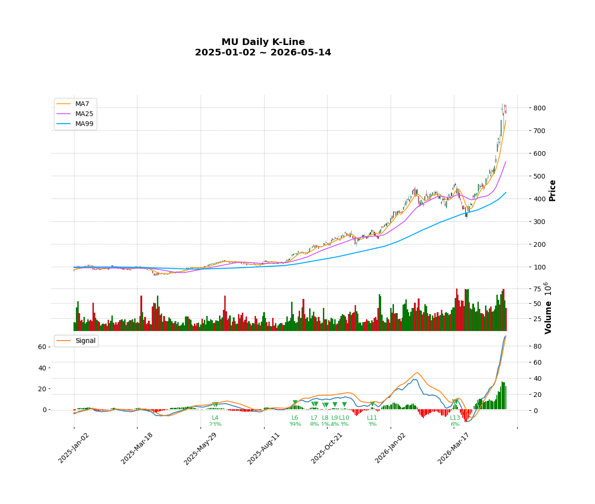
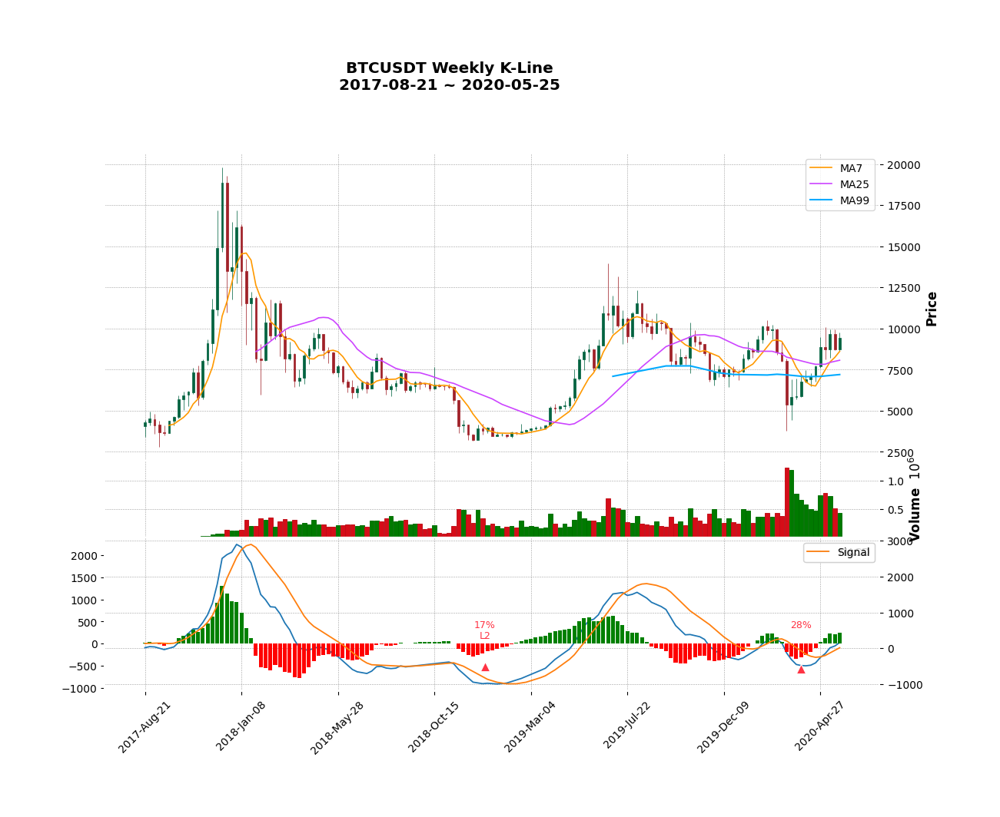
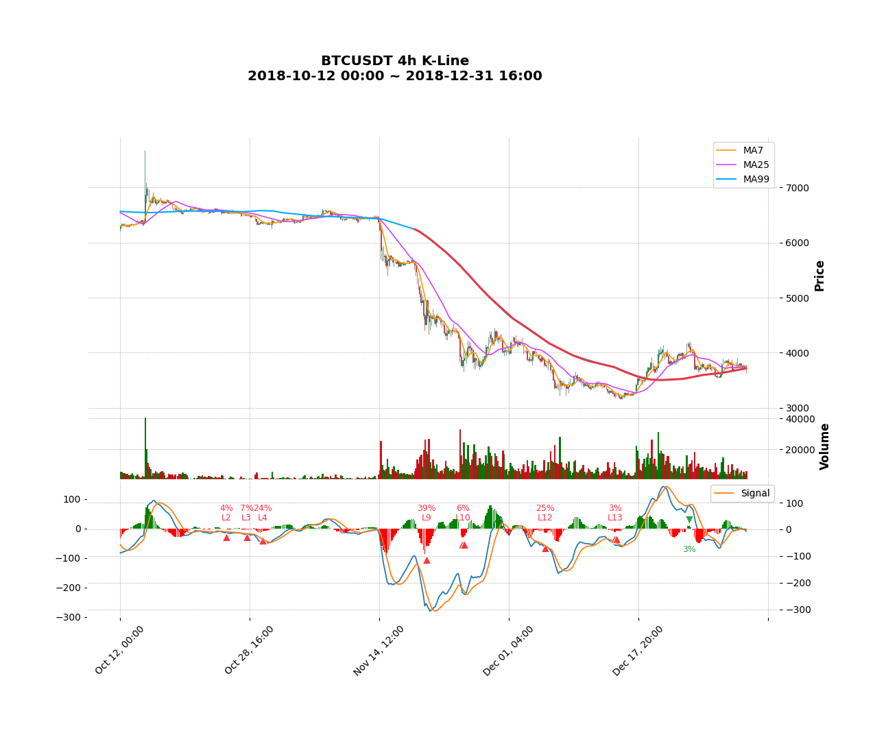

# 明明在涨，为什么系统提示卖？

—— 用"背离钻取"破解大小周期的信号矛盾

---

## 第 1 节：先把矛盾摆出来

*MU 周线图，2025-01 ~ 2026-05*

看美光（MU）这只股票的周线图。

2025 年初到现在，股价从 100 美元涨到 800 美元，几乎没有像样的回调。年初买入一直拿到现在的人，本金翻了 8 倍。

整张周线图上，系统标出来的背离信号只有一个：右上角 `L2 22% ?`。一个带问号的顶背离。

*MU 日线图，2025-01 ~ 2026-05*

但切换到日线，画面就完全不一样了。

从 2025 年中开始，系统一连标出 L4、L6、L7、L8、L9、L10、L11、L13 ——**八个顶背离**，密密麻麻贴在 MACD 下方。每一个都是"力度衰竭"的提示，每一个都长得像卖出信号。

问题来了：

**只看日线、按提示在 L4 那一刻清仓，会发生什么？**

会眼睁睁看着 MU 从 300 美元继续涨到 800 美元，错过整整 1.6 倍的涨幅。然后开始怀疑这套工具是不是在坑人。

朋友们最常问的也是这个问题：

> "系统标了卖出，到底听不听？"

听了，可能错过大涨；不听，又怕真的是顶。

这就是大小周期的信号矛盾。本文用 MU 和 BTC 两个真实案例，演示如何用工具自带的**背离钻取**功能，把这个矛盾解开。

---

## 第 2 节：周线只有一个 `?` 号信号

回到 MU 周线图。整段上涨过程中，系统只在终点附近标出一个背离信号：

`L2 22% ?`

这是一个顶背离（向下的绿色三角），意思是"上涨过程中力度在衰竭"。但旁边那个 `?` 号是关键——必须看懂它。

### `?` 号的含义

打开 MACD 面板可以看到，每个背离信号都对应着一坨同号的 MACD 柱（顶背离对应一坨绿柱，底背离对应一坨红柱）。这"一坨"必须**收尾**了——也就是后面已经翻号到了反向柱——背离才算定案。

而 MU 周线上这条 `L2 22%`，对应的那坨绿柱**还在长**：

- 截至本周，面积比是 22%
- 下一周如果再来一根绿柱，22% 可能变成 25%、30%
- 也可能突然来一根红柱翻号，22% 才真正"封口"
- 还可能后面好几周都继续绿柱，最终封口时是 18% 或 35%——现在完全没法确定

**`?` 号 = 同号柱还在长，当前的数字只是截图，不是判决。**

带 `?` 的信号有两个特性：

1. 数字本身会变（不到封口不算）
2. 信号在视觉上还会被"擦掉"——如果后面来一根超大反向柱，整个背离结构可能不成立

所以一句话总结：**带 `?` 的信号是半成品，不能拿来做决策。**

### 周线上有可执行的信号吗？

回到刚才的问题：**MU 周线上没有任何一个已经定案的卖出信号**。

唯一的那条是 `?`，半成品。其他位置——从 2025 年初到现在——周线 MACD 上根本没有触发背离的同号柱组合。

也就是说，从周线尺度看，MU 现在还**没有进入背离时间**。这段一年半的上涨结构，在周线上是干净的。

---

## 第 3 节：日线上的 8 个卖出信号

切换到 MU 日线。

从 2025 年中开始，到 2026 年 3 月——大约 8 个月的时间——MACD 下方依次出现:

`L4 23% · L6 39% · L7 8% · L8 1% · L9 4% · L10 3% · L11 3% · L13 6%`

八个顶背离。**没有一个带 `?` 号**——它们都已经定案，每一坨同号柱都已经翻号收尾。这一点和周线上那条半成品 `L2 22% ?` 完全不同。

层级也很高。L4、L6、L7…一路到 L13——按这套体系的语义，**层级越高，意味着盘整结构不断在扩张**。同一个时间段里，先出现 L4，然后扩展成 L6，再扩展成 L8……每一次扩展都是把更多的"小波动"打包进同一个嵌套结构，力度衰竭被反复确认。L13 意味着这段盘整已经嵌套到第 13 层——结构高度发育。

从日线尺度看，这些信号本身没什么可挑剔的。它们如实地说："日线 MACD 在反复出现力度衰竭，盘整结构层级越来越高。"

### 两层尺度在说不同的事

回顾一下事实:

- **周线**：上涨结构干净，没有定案的卖出信号
- **日线**：8 个定案卖出信号，密集排列，层级最高到 L13
- **市场**：MU 在这 8 个月里从 300 美元涨到 800 美元

**三个事实摆在一起，信号在矛盾**：日线在反复说"力度衰竭"，但价格反复创新高；周线根本没有卖出的标识，但日线却发出密集的警告。

要解这个矛盾，需要意识到一件事——

**日线信号和周线信号说的不是同一件事。**

日线的 L4-L13 信号说："**日线尺度内**有力度衰竭，结构层级在不断扩张。"  
周线的沉默说："**周线尺度内**还没有力度衰竭。"

两层尺度同时在说话，互相不矛盾——只是层次不同。日线那段不断扩张的盘整结构，在周线尺度下可能只是一根上涨 K 线的内部细节。

那怎么把两个尺度**放到同一张图上**看？

这就是"背离钻取"功能要做的事。

---

## 第 4 节：背离钻取登场

回到 MU 周线图。

在周线图的下方，每一条系统检测到的背离都会变成一张**可点击的卡片**。MU 周线上只有那一条 `L2 22% ?`，所以下方只有一张卡片，标着相同的内容：

`bearish L2 22% ?`

点击它，会发生什么？

正常情况下，系统会自动钻入下一级周期（这里是日线），并做两件事：

1. **在日线主图的 MA99 均线上，把那一坨同号 MACD 柱对应的时间范围染成红色**——就像在地图上圈出一块区域，无论放大几倍，这块区域都还在被圈着。
2. **在那段红色 MA99 内部，标出极值价格那根 K 线**——精确到具体某一根日 K，作为这段时间内"最关键的一刻"。

但是——**这里有一个关键的拦截**。

### `?` 信号不能钻取

`?` 号意味着信号还是半成品。如果以一个半成品作为钻取起点，会发生什么？

钻入日线后，红色 MA99 会画出来一段——但这段时间范围下周可能就变了。因为周线那坨同号绿柱**还在长**，下周再来一根绿柱，s3 段的右端就要向后挪，红色 MA99 也要跟着向右延伸。再下周如果翻号，红色 MA99 又要把延伸的部分擦掉。

**钻取得到的红色区间，跟着 `?` 号信号一起漂移。** 这不是一个稳定的参考点。

所以工具对带 `?` 的信号有一个明确的策略：**不允许钻取**。卡片本身还是显示出来——让操作者看到"这里有个未封口的信号正在形成"，但点击钻取的动作被禁用。

回到 MU 的画面：

- 周线唯一的卡片是 `?`，**点不下去**
- 日线上的 8 个卖出信号，都没有大周期的红色 MA99 作背书

**这就是第 1 节那个困惑的答案**：

MU 周线根本没有提供过一条可执行的钻取入口。日线上那 8 个密集的卖出信号，**没有任何一个能在更大的周期上找到时间锚定**。它们都是日线尺度内自己的盘整扩张——是周线主升浪过程中**没有被升级到周线尺度**的回调节奏。

公理体系的原话是这样说的：

> 小周期的买卖点信号，如果在大周期上没有对应的标识，就是被大周期方向掩盖的噪声。

MU 这 8 个月，就是这段话最干净的例子。

---

## 第 5 节：BTC 案例——一次完整的钻取链

MU 是反面案例：周线根本没有可钻取的信号，日线密集警告都是噪声。

下面看一个正面案例，对比着学。

*BTC 周线图，2017-08-21 ~ 2020-05-25*

这是 BTC 在 2017-2020 三年间的周线图。经历了 2017 年底的牛市顶部、2018 年全年熊市下跌、2019 年初触底——一个完整的大周期循环。

底部附近，系统检测到两条**底背离**（向上的红色三角）：

- 左边：`L2 17%`
- 右边：`28%`

重点看左边那条 `L2 17%`——**没有 `?` 号**。这意味着它已经定案：MACD 那段红色柱已经翻号封口，17% 是确定的数字。

这就是一条**可钻取的入口**。

点击这张卡片，发生什么？

系统从周线钻入下一级（3day），再点 3day 上的同向卡片钻入 daily，再点 daily 上的同向卡片钻入 4h——红色 MA99 在整条钻取链上一直保持显示。这里直接展示钻到 4h 后的画面：

*BTC 4h K-Line, 2018-10-12 ~ 2019-01-17*

看 4h 主图。

**MA99 中间有一大段醒目的红色**——从 2018 年 11 月中旬延伸到 2019 年 1 月中旬，约 2 个月。这就是周线 `L2 17%` 那一坨红色 MACD 柱在 4h 上的投影。

这段红色 MA99 的物理含义是：**周线尺度上那次力度衰竭，对应 4h 尺度的这两个月时间。** 大周期那个"模糊的衰竭信号"，被精确翻译成了一段具体的时间窗。

### 红色 MA99 区间内的子背离

仔细看 4h 图上的 MACD 面板。

在红色 MA99 段内，4h 图自己又检测到一连串**同向底背离**：

`L9 39% · L10 6% · L12 25% · L13 3% · L5 0%`

每一个都是 4h 尺度上"力度衰竭"的独立确认。注意层级——L9、L10、L12、L13——已经是相当高的嵌套层级了。这意味着在红色 MA99 段内部，4h 尺度的盘整结构也在反复扩张，把"力度衰竭"反复确认了多次。

**这就是公理体系的另一半：**

> 大周期的买卖点信号，在小周期上必然存在对应的同向信号。

周线说"这里有底部结构"——它不告诉哪一刻见底；4h 在同一段时间里精细确认了一系列底部子背离——它告诉每一次"小衰竭"出现在哪。两个尺度一起说话，前者定方向，后者定细节。

### 反向小信号怎么处理？

注意 4h 图右半段，红色 MA99 区间内还有一个孤零零的**反向顶背离** `3%`（绿色三角，2018 年 12 月下旬）。

按 MU 案例学到的逻辑：**这条反向小信号，在更大尺度上没有背书**（周线整段时间是底部探底过程，没有顶背离）。所以它是底部形成过程中的一次小反弹噪声，不是真正的反转信号。

这正是为什么"先看大周期"是这套工作流的起手式——**先确定大周期方向，小周期里所有反向小信号都自动归类为噪声**。不需要逐个去判断"这个反向信号该不该听"，大周期已经替你做了过滤。

---

## 第 6 节：工作流总结

两个案例对照学完，把动作清单抽出来：

1. **从大周期看起**（月线、周线，看自己想操作的尺度）
2. **找当前已定案的同向背离**（注意排除带 `?` 的未封口信号）
3. **点击卡片钻取**，看红色 MA99 在下一级周期上的投影
4. **在红色区间内**，子级别的同向信号是"主线的精细确认"；反向信号是"主线内部的回踩噪声"
5. **继续往下钻**，直到达到想要的操作精度（4 小时？15 分钟？看操作周期）

这个流程的核心不是"找信号"——是**用大尺度限定小尺度的解释方向**。

一句话总结：

> 看到小周期信号别急着动作，先往上看一级——大周期不背书的信号，都是更大尺度趋势内部的小波浪。

---

## 第 7 节：必读的边界提醒

工具不是万能的。下面 5 条是这套工作流明确**不适用**的场景。

**1. `?` 标记的信号永远不要钻取。**

它本身就是未封口的快照，钻下去得到的红色区间会随着 K 线更新而漂移，没有稳定的参考价值。看到 `?` 唯一该做的事是——继续等，等它封口。

**2. 横盘期的背离信号容易频繁、互相矛盾。**

无趋势的震荡区间，大小级别都会反复出现弱背离，多空交替。这种环境下工具帮不上忙——是市场本身没结构。横盘期最安全的判断是"看不懂就不动"。

**3. 新闻事件、财报跳空、涨跌停。**

这些情况下产生的极端 K 线会污染 MACD，导致面积比异常。背离需要"可比较的力度"作为前提；当价格变化主要由消息驱动而非自然力度积累时，比的不是同一个东西。这种行情下信号本身不可靠，不该作为决策依据。

**4. 工具只描述结构，不替任何人做决策。**

系统标注"力度衰竭"，不等于它在说"应该卖"。是不是该动作，取决于操作周期、仓位、风险承受能力——这些只有操作者本人知道。**工具让信号被看见，决策永远是自己的事。**

**5. 不同的操作周期，看同一张图得出的结论可以完全不同。**

日内交易者关心 15 分钟级的背离信号；中线持仓者看日线和 4 小时；长期持有者只看月线和周线。**先想清楚自己是哪一类操作者，再决定从哪一级开始钻取。**

跳过这一步，会出现一种很常见的错配——长线投资者被日线的密集卖出吓走，短线交易者被周线的"信号沉默"忽悠成长期持有。两种错配都跟工具无关，跟自我认知有关。

---

## 第 8 节：结尾

工具的核心不是预测——是让结构被看见。

大周期定方向，小周期定时机。

看到日线密集卖出，先往上看一级；看到周线背离，再往下钻一级。红色 MA99 把每一级图都串成同一段时间，迷失的方向自然会回来。

剩下的，是怎么决定动作的事——那不属于工具，属于操作者自己。

---
